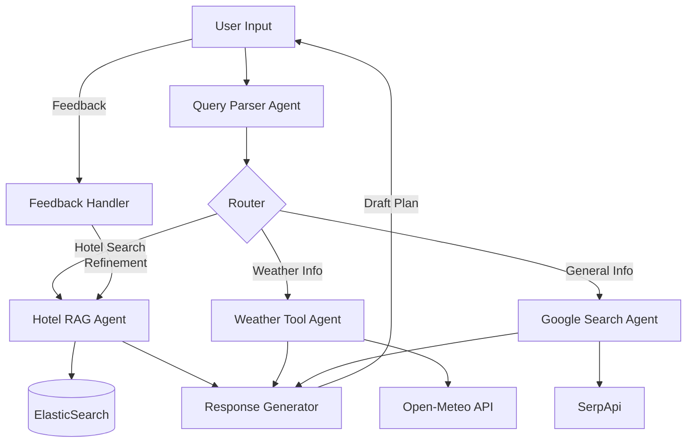

# 🌍 AgenticTravelRAG (A.R.T)

> **Google Gemini와 LangGraph를 활용한 TripAdvisor 리뷰 기반 에이전틱 여행 플래너**
>
> 사용자의 복잡한 여행 요구사항을 이해하고, 리뷰 데이터와 실시간 정보(날씨, 검색)를 결합하여 최적의 여행 일정을 제안합니다.

[](https://www.python.org/downloads/)
[](https://github.com/langchain-ai/langchain)
[](https://github.com/langchain-ai/langgraph)
[](https://platform.openai.com/)
[](https://www.elastic.co/)
[](https://fastapi.tiangolo.com/)
[](https://streamlit.io/)
[](https://huggingface.co/docs/datasets)
[](https://www.sbert.net/)


## 📋 목차

  - [개요]
  - [핵심 기능]
  - [시스템 아키텍처]
  - [기술 스택]
  - [설치 및 실행]
  - [프로젝트 구조]
  - [데이터셋 처리]

-----

## 🎯 개요

A.R.T는 단순한 키워드 매칭을 넘어, \*\*LLM(Google Gemini)\*\*의 추론 능력과 **ElasticSearch**의 하이브리드 검색을 결합한 차세대 여행 에이전트입니다.

### 💡 기존 여행 검색의 한계 vs A.R.T의 혁신

| 기존 검색 서비스 | 🚀 A.R.T (Agentic RAG Traveler) |
|------------------|-----------------------------------|
| "호텔 파리" 단순 키워드 검색 | **"파리에서 12월에 묵을 조용하고 낭만적인 호텔"** 등 추상적 의도 이해 |
| 정적인 데이터베이스 정보만 제공 | **실시간 날씨, 최신 가격 정보**를 에이전트가 직접 수집하여 반영 |
| 일방적인 정보 전달 | **Multi-turn 대화**를 통해 예산 조정, 일정 변경 등 상호작용 가능 |
| 언어 장벽 존재 | **한국어 쿼리 자동 번역**을 통해 글로벌 리뷰 데이터 검색 가능 |

-----

## 🚀 핵심 기능

### 1\. 🧠 Agentic Workflow (LangGraph)

  - **Query Parser**: 자연어 질문에서 목적지, 날짜, 예산, 선호도(분위기, 편의시설)를 정교하게 추출
  - **Router**: 질문의 의도에 따라 호텔 검색, 날씨 조회, 일반 대화 등으로 경로 자동 분기
  - **Self-Correction**: 검색 결과가 없거나 부족할 경우, 검색 조건을 완화하거나 대체 방법을 스스로 모색

### 2\. 🔍 Hybrid RAG (ElasticSearch)

  - **BM25(키워드) + Vector(시맨틱)** 하이브리드 검색 구현
  - 리뷰 텍스트의 감성 분석을 통해 "친절한 직원", "맛있는 조식" 같은 정성적 조건 필터링

### 3\. 🌐 Multi-Modal Tool Use

  - **Google Gemini 2.5 (Flash/Pro)**: 고성능 추론 및 응답 생성
  - **Open-Meteo API**: 여행 기간 및 지역에 맞춘 정확한 날씨 예보 제공
  - **SerpApi (Google Search)**: 최신 호텔 가격 및 관광지 정보 보강

-----

## 🏗️ 시스템 아키텍처



-----

## 🔧 기술 스택

  - **Language Model**: Google Gemini 2.5 Flash (Parsing) / Pro (Generation)
  - **Orchestration**: LangGraph, LangChain
  - **Search Engine**: ElasticSearch 8.14
  - **Embedding**: sentence-transformers/all-MiniLM-L6-v2
  - **Backend**: FastAPI, Uvicorn
  - **Frontend**: Streamlit
  - **External APIs**: Open-Meteo, SerpApi

-----

## 🚦 설치 및 실행

### 1\. 사전 준비

  - Docker & Docker Compose
  - Python 3.9+
  - **Google AI Studio API Key** (Gemini 사용)

### 2\. 환경 설정

```bash
# 저장소 클론
git clone https://github.com/b8goal/AgenticTravelRAG.git
cd AgenticTravelRAG

# 의존성 설치
pip install -r requirements.txt

# 환경변수 설정
cp config/.env.example config/.env
# config/.env 파일을 열어 GOOGLE_API_KEY 등을 입력하세요.
```

### 3\. 데이터베이스 실행 및 데이터 주입

```bash
# 1. ElasticSearch 실행
docker-compose -f docker/docker-compose.yml up -d elasticsearch

# 2. 데이터 다운로드 및 전처리
python -m data.scripts.download_data

# 3. 데이터 인덱싱 (가상 메타데이터 주입 포함)
python -m data.scripts.index_to_elastic
```

### 4\. 서비스 실행

#### 옵션 1: CLI로 Agent 직접 실행 (추천)

터미널에서 바로 Agent와 대화할 수 있습니다.

**대화형 모드:**
```bash
python scripts/run_agent.py --interactive
```

**단일 쿼리 실행:**
```bash
python scripts/run_agent.py --query "파리에서 12월에 묵을 낭만적인 호텔 추천해줘"
```

**세션 ID 지정하여 대화 이어가기:**
```bash
python scripts/run_agent.py --interactive --session-id my-session
```

**도움말 보기:**
```bash
python scripts/run_agent.py --help
```

#### 옵션 2: Web UI 실행

두 개의 터미널에서 각각 실행합니다.

**Terminal 1 (Backend API):**

```bash
uvicorn src.api.main:app --reload --port 8000
```

**Terminal 2 (Frontend UI):**

```bash
streamlit run src/ui/app.py
```

브라우저에서 `http://localhost:8501` 접속 후 여행 계획을 요청해 보세요\!

-----

## 📊 데이터셋 처리

본 프로젝트는 **TripAdvisor Review Dataset**을 사용합니다.

  - **출처**: [HuggingFace - jniimi/tripadvisor-review-rating](https://huggingface.co/datasets/jniimi/tripadvisor-review-rating)
  - **문제점**: 원본 데이터셋에는 호텔의 실제 이름과 위치 정보가 익명화되어 있습니다.
  - **해결책 (Synthetic Metadata)**: RAG 시스템의 동작을 시연하기 위해, 인덱싱 과정에서 각 호텔 ID에 **유명 도시(Paris, Seoul, Bangkok 등)와 가상의 호텔 이름을 랜덤하게 매핑**하여 주입했습니다. 이를 통해 사용자는 실제 도시 이름으로 검색하고 결과를 확인할 수 있습니다.

-----

## 🧪 테스트

### 테스트 구조

프로젝트는 **3단계 테스트 전략**을 사용합니다:

#### 1. **Unit Tests** (`tests/unit/`)
- 외부 API 호출 없이 Mock을 사용한 빠른 테스트
- 각 에이전트의 로직만 검증
- CI/CD에서 자동 실행

```bash
# 전체 unit test 실행
python -m pytest tests/unit/ -v

# Weather Agent unit test만 실행
python -m pytest tests/unit/test_agents.py::test_weather_tool_api_parsing -v
```

#### 2. **Integration Tests** (`tests/integration/`)
- 실제 API를 호출하는 통합 테스트
- 느리지만 현실적인 검증
- 필요할 때만 선택적으로 실행

```bash
# Weather Agent integration test
python -m pytest tests/integration/test_weather_integration.py -v -m integration

# 전체 워크플로우 integration test
python -m pytest tests/integration/test_workflow.py -v
```

#### 3. **Examples** (`examples/`)
- Weather Agent의 다양한 기능을 체험해볼 수 있는 데모입니다.
- 자세한 사용법과 옵션은 [examples/README.md](examples/README.md)를 참고하세요.

```bash
# 기본 실행
python examples/weather_agent_demo.py
```

### Weather Agent 예시

**빠른 검증 (Unit Test):**
```bash
python -m pytest tests/unit/test_agents.py -k weather -v
```

**실제 API 호출 (Integration Test):**
```bash
python -m pytest tests/integration/test_weather_integration.py::test_weather_agent_real_api -v -s
```

**데모 실행 (상세 옵션은 examples/README.md 참고):**
```bash
python examples/weather_agent_demo.py
```

-----

## 📁 프로젝트 구조

```
AgenticTravelRAG/
├── src/
│   ├── agents/          # LangGraph 개별 에이전트 (Parser, RAG, Weather 등)
│   ├── core/            # 상태 관리(State) 및 워크플로우(Workflow) 정의
│   ├── rag/             # ElasticSearch 연결 및 하이브리드 검색 로직
│   ├── api/             # FastAPI 백엔드 서버
│   └── ui/              # Streamlit 프론트엔드
├── data/
│   ├── scripts/         # 데이터 다운로드 및 인덱싱 스크립트
│   └── raw/             # 원본 데이터 저장소
├── config/              # 환경 변수 및 설정 파일
├── tests/               # 단위 및 통합 테스트
└── docker/              # Docker 설정 파일
```
