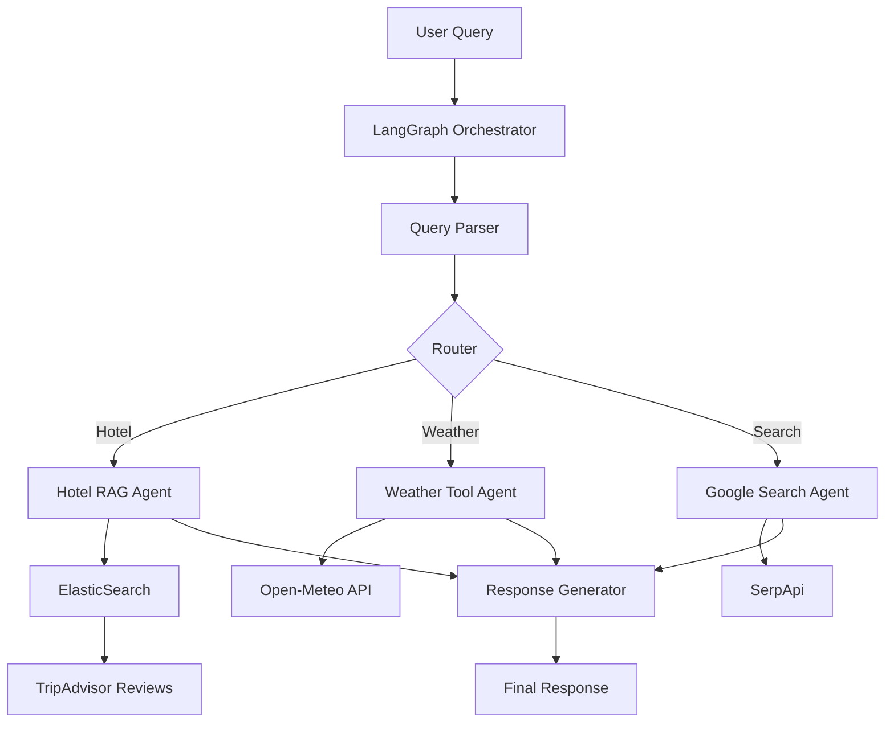

# 🌍 A.R.T (Agentic RAG Traveler)

> **TripAdvisor 리뷰 데이터를 기반으로, 사용자가 자연어로 여행 요구사항을 질문하면 관련 호텔·액티비티를 찾아주고 맞춤형 여행 일정을 제안하는 Agentic RAG 기반 지능형 여행 플래너**

[](https://www.python.org/downloads/)
[](https://github.com/langchain-ai/langgraph)
[](https://www.elastic.co/)
[](LICENSE)

## 📋 목차
- [개요](#개요)
- [핵심 기능](#핵심-기능)
- [아키텍처](#아키텍처)
- [시작하기](#시작하기)
- [프로젝트 구조](#프로젝트-구조)
- [API 문서](#api-문서)
- [기여 가이드](#기여-가이드)

## 🎯 개요

A.R.T는 **실제 여행자 리뷰 텍스트 데이터를 활용하여, 단순한 키워드 매칭을 넘어 사용자의 추상적이고 복잡한 요구사항을 이해하는** 차세대 여행 플래너입니다.

### 왜 A.R.T인가?

기존 여행 검색 서비스의 한계:
- ❌ "조용하고 낭만적인 호텔" 같은 추상적 요구 이해 불가
- ❌ 실시간 날씨나 가격 정보 미반영
- ❌ 대화형 피드백 불가능

A.R.T의 혁신:
- ✅ **리뷰 텍스트 기반 시맨틱 검색**으로 추상적 요구사항 이해
- ✅ **실시간 API 연동**으로 날씨, 가격 정보 제공
- ✅ **Multi-turn 대화**로 점진적 계획 수정

## 🚀 핵심 기능

### 1. 🔍 리뷰 기반 하이브리드 호텔 검색 (RAG)
- **정형 조건**: "무료 주차", "조식 포함" 등
- **비정형 조건**: "분위기 좋은", "가족 친화적인" 등
- **ElasticSearch 하이브리드 검색** (BM25 + 시맨틱)

### 2. 🌐 외부 도구 연동 (Agentic Tools)
- **날씨 정보**: Open-Meteo API (무료)
- **실시간 가격**: Google 검색 (SerpApi)
- **지도 정보**: 위치 기반 추천

### 3. 💬 Multi-Turn 대화형 일정 생성
- 컨텍스트 유지 및 메모리 관리
- 사용자 피드백 반영
- 점진적 계획 개선

## 🏗️ 아키텍처



## 🚦 시작하기

### 전제 조건
- Python 3.9+
- Docker & Docker Compose
- Git

### 빠른 시작

```bash
# 1. 저장소 클론
git clone https://github.com/your-team/ART-project.git
cd ART-project

# 2. 환경 설정
make setup

# 3. 서비스 시작
make start

# 4. 테스트
make test
```

자세한 설치 가이드는 [SETUP.md](docs/SETUP.md)를 참조하세요.

## 📁 프로젝트 구조

```
ART-project/
├── src/                      # 소스 코드
│   ├── agents/              # LangGraph 에이전트
│   ├── tools/               # 외부 API 도구
│   ├── rag/                 # RAG 파이프라인
│   └── core/                # 핵심 로직
├── data/                    # 데이터 관련
│   ├── raw/                # 원본 데이터
│   ├── processed/          # 전처리된 데이터
│   └── scripts/            # ETL 스크립트
├── config/                  # 설정 파일
├── tests/                   # 테스트 코드
├── docs/                    # 문서
└── docker/                  # Docker 설정
```

## 📊 데이터셋

- **TripAdvisor Review Dataset**: [HuggingFace](https://huggingface.co/datasets/jniimi/tripadvisor-review-rating)
- 약 20,000+ 리뷰
- 평점, 리뷰 텍스트, 메타데이터 포함

## 🔧 기술 스택

- **Orchestration**: LangGraph
- **Search Engine**: ElasticSearch 8.x
- **Embedding**: Sentence-Transformers
- **LLM**: OpenAI GPT-4 / Anthropic Claude
- **APIs**: Open-Meteo, SerpApi
- **Framework**: FastAPI
- **Frontend**: Streamlit

## 👥 기여 가이드

[CONTRIBUTING.md](CONTRIBUTING.md)를 참조하여 프로젝트에 기여해주세요.

### 브랜치 전략
- `main`: 프로덕션 배포
- `develop`: 개발 통합
- `feature/*`: 기능 개발
- `hotfix/*`: 긴급 수정

## 📝 라이센스

MIT License - 자세한 내용은 [LICENSE](LICENSE) 참조

## 🙏 감사의 말

- TripAdvisor 데이터셋 제공: jniimi
- LangGraph 팀
- ElasticSearch 커뮤니티

---

**A.R.T - 당신의 완벽한 여행을 위한 AI 파트너** 🌟
