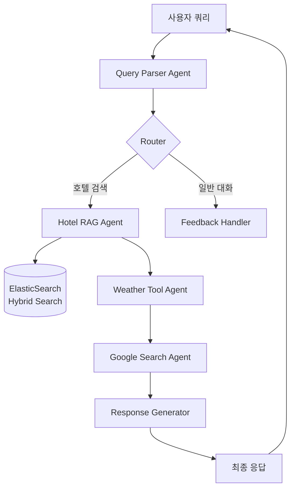

# AgenticTravelRAG 시스템 분석 및 개선 방안

> **작성일:** 2025-11-26  
> **작성자:** LLM Agentic RAG 전문가  
> **목적:** 현재 시스템의 동작 분석, 고도화 필요 영역 식별, 문제점 및 해결 방안 제시

---

## 📊 1. 현재 시스템 동작 분석

### 1.1 시스템 아키텍처 개요



### 1.2 현재 워크플로우 동작

**Phase 1: Query Parsing**
- Gemini 2.5 Flash를 사용하여 자연어 쿼리 파싱
- 목적지, 날짜, 인원, 선호도 추출
- 한국어 → 영어 자동 번역 (검색 정확도 향상)

**Phase 2: Hotel Search (RAG)**
- ElasticSearch 하이브리드 검색 (BM25 + Vector)
- TripAdvisor 리뷰 데이터 기반 호텔 추천
- 평점, 위치, 분위기 키워드로 필터링

**Phase 3: Context Enrichment**
- Weather Tool: Open-Meteo API로 2주 이내 날씨 조회
- Google Search: 최신 호텔 가격 및 관광 정보 보강

**Phase 4: Response Generation**
- Gemini 2.5 Pro로 최종 여행 계획 생성
- 호텔, 날씨, 검색 정보를 통합한 맞춤형 일정 제공

### 1.3 예상 결과물

**입력 예시:**
```
"파리에서 12월 15일부터 3박 4일 묵을 낭만적인 호텔 추천해줘"
```

**출력 예시:**
```markdown
# 파리 3박 4일 여행 계획

## 추천 호텔
1. **Hotel Romantic Paris** (평점: 4.5/5)
   - 위치: 몽마르뜨 언덕 근처
   - 가격대: $$$ (중상급)
   - 하이라이트: 에펠탑 전망, 조용한 분위기, 친절한 직원

## 날씨 정보
| 날짜 | 날씨 | 최저기온 | 최고기온 | 강수량 |
|------|------|----------|----------|--------|
| 2025-12-15 | 흐림 | 3°C | 8°C | 0mm |
| 2025-12-16 | 약한 비 | 5°C | 9°C | 2.5mm |
| 2025-12-17 | 맑음 | 2°C | 7°C | 0mm |

## 여행 일정
Day 1: 체크인 및 몽마르뜨 탐방
Day 2: 루브르 박물관 & 센 강 유람선
Day 3: 에펠탑 & 샹젤리제 거리
Day 4: 체크아웃 및 귀국
```

---

## 🚀 2. 고도화가 필요한 영역

### 2.1 RAG 성능 개선 (Critical)

**현재 문제:**
- 하이브리드 검색의 alpha 값이 고정 (0.5)
- 쿼리 유형에 따른 동적 가중치 조정 부재
- 리뷰 텍스트만 검색, 메타데이터 활용 부족

**개선 방안:**
```python
# 동적 alpha 조정
def adaptive_alpha(query_type):
    if query_type == "semantic":  # "낭만적인", "조용한"
        return 0.7  # 벡터 검색 강화
    elif query_type == "keyword":  # "에펠탑 근처", "조식 포함"
        return 0.3  # BM25 강화
    else:
        return 0.5  # 균형
```

**추가 개선:**
- Re-ranking 모델 도입 (Cross-Encoder)
- Query Expansion (동의어, 관련어 확장)
- Negative Sampling (부정적 리뷰 필터링)

### 2.2 Multi-Turn 대화 개선 (High Priority)

**현재 문제:**
- 대화 컨텍스트 유지가 제한적
- 이전 검색 결과를 재활용하지 않음
- 사용자 피드백 반영 메커니즘 미흡

**개선 방안:**
```python
# 대화 메모리 강화
class ConversationMemory:
    def __init__(self):
        self.search_history = []  # 이전 검색 결과
        self.user_preferences = {}  # 학습된 선호도
        self.rejected_hotels = set()  # 거부한 호텔
    
    def update_preferences(self, feedback):
        # "더 저렴한 곳", "수영장 있는 곳" 등 피드백 분석
        # 선호도 벡터 업데이트
        pass
```

### 2.3 응답 품질 개선 (Medium Priority)

**현재 문제:**
- 응답이 너무 길고 장황함
- 구조화된 정보와 자연어 혼재
- 사용자 맞춤화 부족

**개선 방안:**
- 응답 템플릿 다양화 (간결형 / 상세형)
- 사용자 페르소나 기반 톤 조정
- 핵심 정보 우선 표시 (TL;DR 섹션)

### 2.4 실시간 정보 통합 (Medium Priority)

**현재 문제:**
- Google Search 결과 활용도 낮음
- 가격 정보가 리뷰 텍스트 추정에 의존
- 실시간 예약 가능 여부 미확인

**개선 방안:**
- Booking.com / Expedia API 연동
- 실시간 가격 및 재고 확인
- 프로모션 / 할인 정보 제공

---

## ⚠️ 3. 주요 문제점 및 해결 방안

### 3.1 문제: 검색 결과 없음 (No Results)

**발생 시나리오:**
- 너무 구체적인 조건 (예: "수영장 + 스파 + 루프탑 바")
- 마이너한 도시 검색
- 날짜 제약 (2주 이후)

**해결 방안:**

#### A. Graceful Degradation
```python
async def search_with_fallback(self, params):
    # 1차: 모든 조건으로 검색
    results = await self.rag.hybrid_search(query, **params)
    
    if len(results) < 3:
        # 2차: 필수 조건만 (목적지 + 평점)
        results = await self.rag.hybrid_search(
            query, 
            location=params['location'],
            min_rating=params.get('min_rating', 3.5)
        )
    
    if len(results) < 3:
        # 3차: 유사 도시 추천
        similar_cities = self.get_similar_destinations(params['location'])
        return {"suggestion": f"'{params['location']}'의 호텔이 부족합니다. 
                               대신 {similar_cities}는 어떠세요?"}
    
    return results
```

#### B. Query Relaxation
```python
def relax_query(self, original_query, iteration=1):
    """점진적 쿼리 완화"""
    if iteration == 1:
        # 선호도 키워드 제거
        return remove_atmosphere_keywords(original_query)
    elif iteration == 2:
        # 편의시설 조건 완화
        return remove_amenity_requirements(original_query)
    else:
        # 목적지만 유지
        return extract_destination_only(original_query)
```

### 3.2 문제: 날씨 정보 2주 제한

**현재 상태:**
- 2주 이후 날짜는 날씨 정보 제공 불가
- 사용자에게 안내 메시지만 표시

**해결 방안:**

#### A. 기후 데이터 활용
```python
# 평년 기후 데이터 DB 구축
CLIMATE_DATA = {
    "Paris": {
        12: {"avg_temp": (3, 8), "precipitation": 50, "description": "추운 겨울, 비 가능성"}
    }
}

def get_climate_info(location, month):
    """2주 이후는 평년 기후 정보 제공"""
    return CLIMATE_DATA.get(location, {}).get(month)
```

#### B. 사용자 안내 개선
```markdown
⚠️ 날씨 예보는 2주 이내만 제공됩니다.

**12월 파리 평년 기후:**
- 평균 기온: 3°C ~ 8°C
- 강수량: 약 50mm (비/눈 가능)
- 권장 복장: 두꺼운 외투, 우산 필수
```

### 3.3 문제: 가격 정보 부정확

**현재 상태:**
- 리뷰 텍스트에서 "expensive", "cheap" 키워드로 추정
- 실제 가격과 괴리 가능성

**해결 방안:**

#### A. 가격 범위 표준화
```python
PRICE_RANGES = {
    "$": "1박 50-100 USD",
    "$$": "1박 100-200 USD",
    "$$$": "1박 200-400 USD",
    "$$$$": "1박 400+ USD"
}

def estimate_price_with_confidence(self, review_text):
    """신뢰도 포함 가격 추정"""
    keywords = extract_price_keywords(review_text)
    
    if "expensive" in keywords and "luxury" in keywords:
        return ("$$$$", confidence=0.8)
    elif "budget" in keywords or "cheap" in keywords:
        return ("$", confidence=0.7)
    else:
        return ("$$", confidence=0.3)  # 낮은 신뢰도
```

#### B. 외부 API 연동 (장기)
```python
async def get_real_time_price(self, hotel_name, dates):
    """Booking.com API로 실시간 가격 조회"""
    try:
        price = await booking_api.get_price(hotel_name, dates)
        return price
    except:
        return self.estimate_price_from_reviews(hotel_name)
```

### 3.4 문제: 응답 생성 시간 지연

**현재 상태:**
- 순차적 API 호출 (파싱 → 검색 → 날씨 → 구글 → 생성)
- 전체 응답 시간 5-10초

**해결 방안:**

#### A. 병렬 처리
```python
async def parallel_enrichment(self, state):
    """날씨, 구글 검색 병렬 실행"""
    weather_task = self.weather_tool.get_forecast(...)
    google_task = self.google_search.search(...)
    
    weather, google_results = await asyncio.gather(
        weather_task, 
        google_task
    )
    
    return weather, google_results
```

#### B. 스트리밍 응답
```python
async def stream_response(self, state):
    """점진적 응답 생성"""
    # 1. 호텔 목록 먼저 반환
    yield {"hotels": state['hotel_options']}
    
    # 2. 날씨 정보 추가
    weather = await self.get_weather(...)
    yield {"weather": weather}
    
    # 3. 최종 일정 생성
    itinerary = await self.generate_itinerary(...)
    yield {"itinerary": itinerary}
```

### 3.5 문제: 데이터 품질 (Synthetic Metadata)

**현재 상태:**
- TripAdvisor 데이터셋의 호텔명/위치가 익명화됨
- 가상 메타데이터로 대체 (Paris, Seoul 등)
- 실제 호텔과 매칭 불가

**해결 방안:**

#### A. 실제 호텔 데이터셋 구축
```python
# Booking.com / TripAdvisor 크롤링 (합법적 범위 내)
# 또는 공개 데이터셋 활용
REAL_HOTELS = [
    {"name": "Hotel Le Bristol Paris", "location": "Paris", "rating": 4.8},
    {"name": "The Peninsula Paris", "location": "Paris", "rating": 4.9}
]
```

#### B. 호텔 매칭 시스템
```python
def match_synthetic_to_real(synthetic_hotel):
    """가상 호텔을 실제 호텔과 매칭"""
    # 리뷰 내용 유사도로 실제 호텔 추정
    embeddings = get_embeddings(synthetic_hotel.reviews)
    similar_real_hotels = find_similar(embeddings, REAL_HOTELS)
    return similar_real_hotels[0]
```

---

## 💡 4. 개선 로드맵 (우선순위별)

### Phase 1: Quick Wins (1-2주)

**P0 - Critical**
1. ✅ 날씨 테이블 형식 개선 (완료)
2. ✅ 2주 제한 안내 메시지 (완료)
3. 🔲 검색 결과 없음 시 Fallback 로직
4. 🔲 응답 시간 단축 (병렬 처리)

**구현 예시:**
```python
# 3. Fallback 로직
async def hotel_rag_node_with_fallback(self, state):
    results = await self.hotel_rag.search(params)
    
    if len(results) < 3:
        # 조건 완화하여 재검색
        relaxed_params = relax_search_params(params)
        results = await self.hotel_rag.search(relaxed_params)
        
        state['context_memory']['search_relaxed'] = True
        state['context_memory']['relaxation_message'] = 
            "정확히 일치하는 호텔이 부족하여 조건을 일부 완화했습니다."
    
    return results
```

### Phase 2: Core Enhancements (2-4주)

**P1 - High Priority**
1. 🔲 동적 하이브리드 검색 가중치
2. 🔲 Re-ranking 모델 도입
3. 🔲 대화 메모리 강화
4. 🔲 사용자 피드백 학습

**구현 예시:**
```python
# 1. 동적 가중치
class AdaptiveHybridSearch:
    def __init__(self):
        self.query_classifier = QueryTypeClassifier()
    
    async def search(self, query, **kwargs):
        query_type = self.query_classifier.classify(query)
        alpha = self.get_optimal_alpha(query_type)
        
        return await self.rag.hybrid_search(
            query, 
            alpha=alpha, 
            **kwargs
        )
```

### Phase 3: Advanced Features (1-2개월)

**P2 - Medium Priority**
1. 🔲 실시간 가격 API 연동
2. 🔲 평년 기후 데이터 DB
3. 🔲 응답 스트리밍
4. 🔲 다국어 지원 확대

**구현 예시:**
```python
# 1. 실시간 가격 API
class PriceAggregator:
    def __init__(self):
        self.booking_api = BookingAPI()
        self.expedia_api = ExpediaAPI()
    
    async def get_best_price(self, hotel_name, dates):
        prices = await asyncio.gather(
            self.booking_api.get_price(hotel_name, dates),
            self.expedia_api.get_price(hotel_name, dates)
        )
        return min(prices, key=lambda x: x['price'])
```

### Phase 4: Production Ready (2-3개월)

**P3 - Low Priority**
1. 🔲 A/B 테스팅 프레임워크
2. 🔲 사용자 만족도 추적
3. 🔲 성능 모니터링 대시보드
4. 🔲 자동 재학습 파이프라인

---

## 📝 5. 구현 체크리스트

### 5.1 RAG 성능 개선

- [ ] `src/rag/elasticsearch_rag.py`
  - [ ] `adaptive_alpha()` 메서드 추가
  - [ ] `query_expansion()` 메서드 추가
  - [ ] `rerank_results()` 메서드 추가

- [ ] `src/agents/hotel_rag.py`
  - [ ] `search_with_fallback()` 메서드 추가
  - [ ] `relax_search_params()` 메서드 추가

### 5.2 대화 메모리 강화

- [ ] `src/core/state.py`
  - [ ] `ConversationMemory` 클래스 추가
  - [ ] `search_history` 필드 추가
  - [ ] `user_preferences` 필드 추가

- [ ] `src/core/workflow.py`
  - [ ] `feedback_handler_node()` 개선
  - [ ] 선호도 학습 로직 추가

### 5.3 응답 품질 개선

- [ ] `src/agents/response_generator.py`
  - [ ] 응답 템플릿 다양화
  - [ ] TL;DR 섹션 추가
  - [ ] 페르소나 기반 톤 조정

### 5.4 실시간 정보 통합

- [ ] `src/tools/price_aggregator.py` (신규)
  - [ ] Booking.com API 연동
  - [ ] 가격 비교 로직

- [ ] `src/tools/climate_db.py` (신규)
  - [ ] 평년 기후 데이터 로드
  - [ ] 월별 기후 정보 제공

---

## 🎯 6. 성공 지표 (KPI)

### 6.1 검색 품질
- **목표:** 검색 결과 없음 비율 < 5%
- **측정:** `(no_results_count / total_queries) * 100`

### 6.2 응답 시간
- **목표:** 평균 응답 시간 < 3초
- **측정:** `avg(response_time_per_query)`

### 6.3 사용자 만족도
- **목표:** 긍정 피드백 비율 > 80%
- **측정:** 사용자 평가 (👍/👎)

### 6.4 대화 품질
- **목표:** Multi-turn 대화 성공률 > 70%
- **측정:** 3턴 이상 대화에서 목표 달성 비율

---

## 📚 7. 참고 자료

### 7.1 RAG 최적화
- [Advanced RAG Techniques](https://arxiv.org/abs/2312.10997)
- [Hybrid Search Best Practices](https://www.elastic.co/blog/improving-information-retrieval-elastic-stack-hybrid)

### 7.2 LLM Agent 패턴
- [ReAct: Reasoning and Acting](https://arxiv.org/abs/2210.03629)
- [LangGraph Documentation](https://langchain-ai.github.io/langgraph/)

### 7.3 Production Deployment
- [LLM Observability](https://www.langchain.com/langsmith)
- [Cost Optimization](https://platform.openai.com/docs/guides/production-best-practices)

---

## 🔄 8. 다음 단계

1. **우선순위 합의**: Phase 1 항목 중 먼저 구현할 기능 선정
2. **상세 설계**: 선정된 기능의 구현 계획 수립
3. **프로토타입**: 작은 범위로 POC 구현
4. **평가 및 반복**: KPI 측정 후 개선

---

**문서 버전:** 1.0  
**최종 수정:** 2025-11-26  
**작성자:** LLM Agentic RAG 전문가
